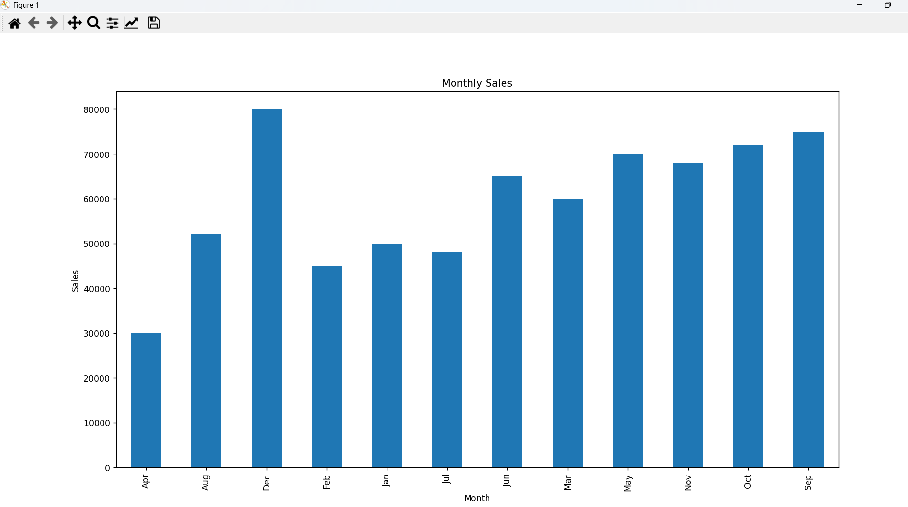
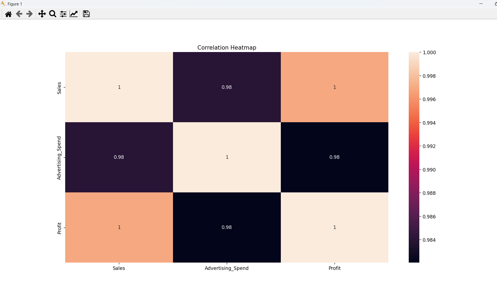

# Practical No. 2 – Classification of Analytical Approaches

## Objective
To implement:
- Descriptive Analytics
- Diagnostic Analytics
- Predictive Analytics
- Prescriptive Analytics

## Tools Used
- Python
- Pandas
- NumPy
- Matplotlib
- Seaborn
- Scikit-learn

## Dataset Columns
- Month
- Region
- Sales
- Advertising_Spend
- Profit

## Analytics Implemented

### 1. Descriptive
- Summary statistics
- Monthly sales visualization

### 2. Diagnostic
- Correlation analysis
- Region-wise comparison

### 3. Predictive
- Linear Regression model
- R² score evaluation

### 4. Prescriptive
- Business recommendation logic

## Output
- Total Sales
- Average Sales
- Correlation Heatmap
- Predicted Sales
- Business Recommendation

## Output Screenshots

### Monthly Sales Graph

### Correlation Heatmap

### Console Output
See results.txt inside output folder.
